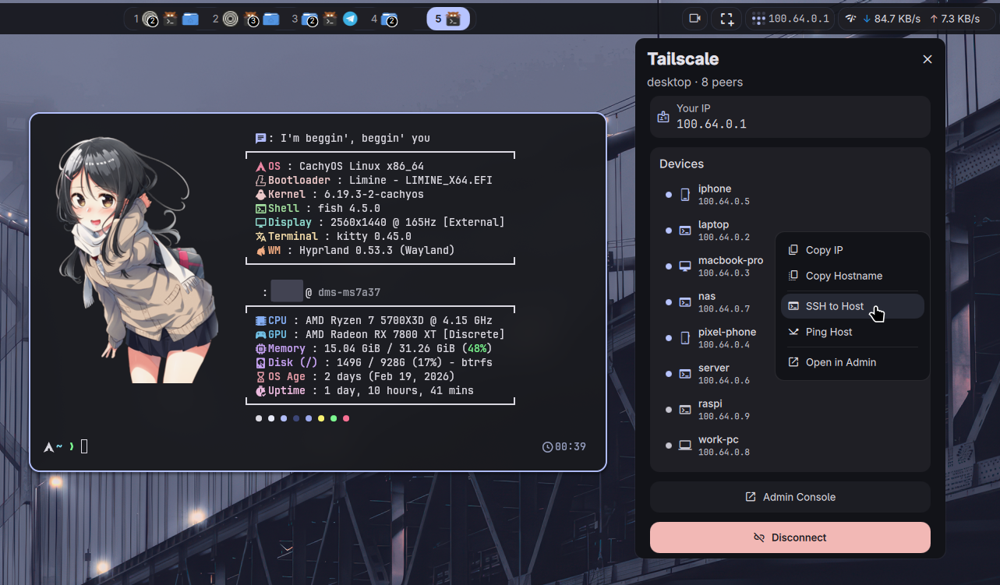

# DankMaterialShell Plugins

A collection of third-party plugins for [DankMaterialShell](https://github.com/AvengeMedia/DankMaterialShell).

[DankLinux](https://danklinux.com) | [Quickshell](https://quickshell.outfoxxed.me/) | [Plugin Registry](https://plugins.danklinux.com/)

## Plugins

### [Tailscale](https://github.com/hxreborn/dms-tailscale/tree/feat/peer-management-panel)

A DMS Bar widget for managing your Tailscale connection and peers. Inspired by [Noctalia's Tailscale plugin](https://github.com/noctalia-dev/noctalia-plugins/tree/main/tailscale), built on [Cooper Glavin's](https://github.com/cglavin50) original widget.



## Installation

Install individual plugins via the DMS CLI:

```bash
dms plugins install <plugin-url>
```

Or clone manually:

```bash
git clone <plugin-url> ~/.config/DankMaterialShell/plugins/<plugin-name>
```
