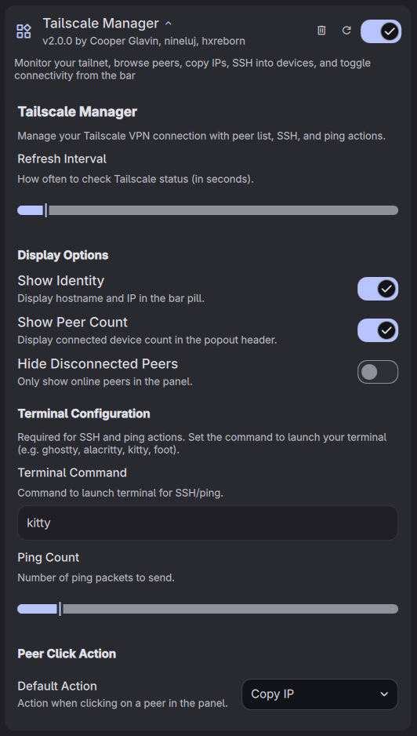
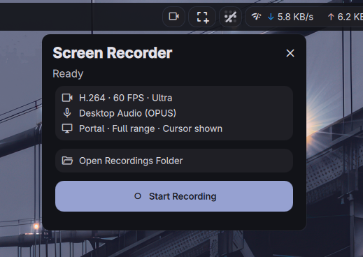
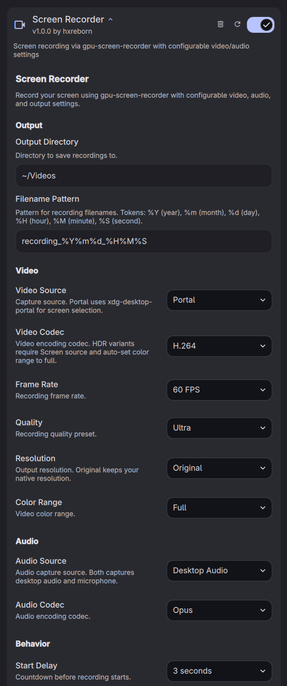

# DankMaterialShell Plugins

A collection of third-party plugins for [DankMaterialShell](https://github.com/AvengeMedia/DankMaterialShell).

    

[DankLinux](https://danklinux.com) | [Quickshell](https://quickshell.outfoxxed.me/)

## Plugins

Should work on any Quickshell-supported compositor (Hyprland, Niri, Sway, labwc, MangoWC, Scroll). Tested on Hyprland.

### [Tailscale Manager](./dms-tailscale-manager)

A DMS bar widget for managing your Tailscale connection and peers.


<details>
<summary>Settings</summary>



</details>

Install:

```bash
git clone --depth 1 https://github.com/hxreborn/dms-plugins.git /tmp/dms-plugins \
  && cp -r /tmp/dms-plugins/dms-tailscale-manager ~/.config/DankMaterialShell/plugins/tailscaleManager \
  && rm -rf /tmp/dms-plugins
```

### [Screen Recorder](./dms-screen-recorder)

A DMS bar widget wrapping `gpu-screen-recorder` for screen recording with configurable video, audio, and capture settings.



<details>
<summary>Settings</summary>



</details>

Install:

```bash
git clone --depth 1 https://github.com/hxreborn/dms-plugins.git /tmp/dms-plugins \
  && cp -r /tmp/dms-plugins/dms-screen-recorder ~/.config/DankMaterialShell/plugins/screenRecorder \
  && rm -rf /tmp/dms-plugins
```

Then enable in Settings -> Plugins -> Scan for Plugins.

## Credits

Both plugins were inspired by [Noctalia's plugin collection](https://github.com/noctalia-dev/noctalia-plugins).

## License

[MIT](./LICENSE)
